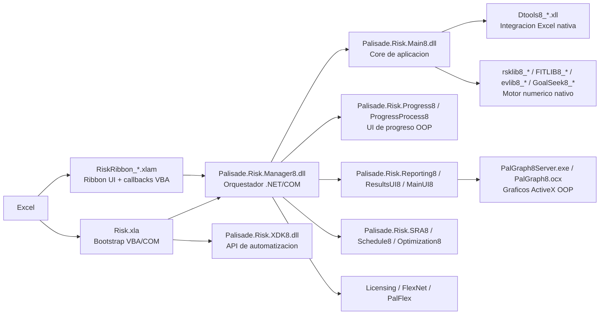

# Analisis de arquitectura de @RISK 8

## Alcance

Este documento reconstruye la arquitectura de `@RISK 8` a partir de la instalacion local en:

- `C:\Program Files (x86)\Palisade\RISK8`
- `C:\Program Files (x86)\Palisade\System`

No es una lectura del codigo fuente original. Es una **ingenieria inversa ligera** basada en:

- estructura de carpetas
- tipos de archivo
- metadatos PE/.NET
- referencias COM/TLB
- cadenas internas encontradas en `Risk.xla`, `RiskRibbon_*.xlam` y binarios auxiliares

Por eso, en este informe separo lo **confirmado** de lo **inferido**.

## Resumen ejecutivo

`@RISK 8` no parece estar construido como una sola aplicacion. La huella instalada muestra una **arquitectura hibrida y evolutiva**, con estas capas:

1. **Capa Excel / Add-in legacy**
   - `Risk.xla`
   - `RiskRibbon_EN.xlam`, `RiskRibbon_ES.xlam`, `RiskRibbon_HI.xlam`
   - `RiskTempStartup.xlsx`

2. **Capa de orquestacion COM + .NET**
   - `Palisade.Risk.Main8.dll`
   - `Palisade.Risk.Manager8.dll`
   - `Palisade.Risk.XDK8.dll`
   - varias `.tlb` para exponer interfaces COM

3. **Capa de motor numerico nativo**
   - `rsklib8_x86.dll`, `rsklib8_x64.dll`
   - `FITLIB8_*`, `GoalSeek8_*`, `evlib8_*`, `MsgDBS8_*`, `PalFlex8_*`
   - `Dtools8_x86.xll`, `Dtools8_x64.xll`

4. **Procesos auxiliares fuera de Excel**
   - `RiskOutOfProcessServer.exe`
   - `Palisade.Risk.ProgressProcess8.exe`
   - `PalGraph8Server.exe`
   - `PalGraph8.ocx`

5. **Capa de extensibilidad / automatizacion**
   - `XDK\RiskOL8.chm`
   - `Palisade.Risk.XDK8.dll`
   - `Palisade.Risk.XDK8.tlb`
   - ejemplos `.xlsm` de automatizacion

La conclusion mas importante es esta: **@RISK 8 es un sistema Office-centric, con shell legacy en VBA/VB6, logica de aplicacion en .NET 4, y motores de calculo nativos x86/x64**.

## Hallazgos confirmados

### 1. La entrada principal sigue siendo Excel

En `C:\Program Files (x86)\Palisade\RISK8` solo aparecen unos pocos archivos "top-level":

- `Risk.xla`
- `RiskRibbon_EN.xlam`
- `RiskRibbon_ES.xlam`
- `RiskRibbon_HI.xlam`
- `RiskOutOfProcessServer.exe`
- `RiskTempStartup.xlsx`

Eso ya indica que el producto no arranca como una app desktop independiente; **vive dentro de Excel** y se monta como add-in.

### 2. El ribbon moderno esta empaquetado como add-in macro-enabled

`RiskRibbon_EN.xlam` es un paquete Open XML con:

- `customUI/customUI.xml`
- `xl/vbaProject.bin`
- `xl/vbaProjectSignature.bin`
- hojas ocultas (`workbookView visibility="veryHidden"`)

Los callbacks extraidos de `customUI.xml` fueron:

- `RiskRibbonEvent_CommandClick`
- `RiskRibbonEvent_GalleryItemSelected`
- `RiskRibbonEvent_RibbonLoad`
- `RiskRibbonQuery_GetControlText`
- `RiskRibbonQuery_GetDynamicMenuContent`
- `RiskRibbonQuery_GetEnabledState`
- `RiskRibbonQuery_GetItemCount`
- `RiskRibbonQuery_GetToggleState`
- `RiskRibbonQuery_GetVisibility`

Esto confirma que el ribbon se implementa con **Office Custom UI + VBA**, y no como VSTO puro.

### 3. `Risk.xla` contiene la logica legacy de bootstrap

`Risk.xla` es un contenedor OLE clasico (`D0 CF 11 E0 ...`), es decir, un add-in binario antiguo de Excel.

Las cadenas internas encontradas en `Risk.xla` son especialmente reveladoras. Aparecen, entre otras:

- `Palisade.Risk.Manager8.tlb`
- `Palisade.Risk.XDK8.tlb`
- `Create the Progress Window Server. This is ALWAYS out of process.`
- `Load and initialize the Risk.Main library via it's COM entry point`
- `Create a Dtools callback object`
- `Set g_RiskProgress = CreateObject(PROGID_PROGRESS)`
- `This is the root .NET object for the @RISK Application in Palisade.Risk.Manager`
- `This mutex is used to indicate to the out-of-process components that the add-in is still alive`
- `AtRiskMutexAddinLoaded8`
- `PalisadeSurvivalMutex_RiskXLA`

Eso permite afirmar que `Risk.xla` no es solo UI legacy: tambien hace de **bootstrapper**, **puente COM** y **coordinador de ciclo de vida**.

### 4. Existe una capa .NET claramente modular

Los siguientes ensamblados se cargan como assemblies .NET administrados:

- `Palisade.Risk.Main8.dll` -> `MSIL`
- `Palisade.Risk.Manager8.dll` -> `MSIL`
- `Palisade.DT.Core8.dll` -> `MSIL`
- `Palisade.Risk.Progress8.dll` -> `MSIL`
- `Palisade.Risk.XDK8.dll` -> `MSIL`
- `Palisade.Risk.SRA8.dll` -> `MSIL`
- `Palisade.Risk.Optimization8.dll` -> `MSIL`
- `Palisade.Risk.Schedule8.dll` -> `MSIL`
- `Palisade.Risk.Reporting8.dll` -> `MSIL`

Ademas, varias tienen su `.tlb` asociada, lo que sugiere fuertemente que son **COM-visible** para ser consumidas desde VBA/VB6/Excel.

### 5. `Palisade.Risk.Manager8.dll` funciona como orquestador de alto nivel

Las referencias cargadas por `Palisade.Risk.Manager8.dll` incluyen:

- `Palisade.Risk.Main8`
- `Palisade.Risk.MainUI8`
- `Palisade.Risk.ModelUI`
- `Palisade.Risk.Optimization8`
- `Palisade.Risk.Progress8`
- `Palisade.Risk.Reporting8`
- `Palisade.Risk.ResultsUI8`
- `Palisade.Risk.SRA8`
- `Palisade.DT.Core8`
- `Palisade.DT.Graphing8`
- `Palisade.DT.DataViewer8`

Esto encaja con un rol de **facade/orchestrator** sobre modulos especializados.

### 6. El motor numerico no esta escrito en VBA ni solo en .NET

En `C:\Program Files (x86)\Palisade\System` aparecen los binarios pesados:

- `rsklib8_x86.dll` / `rsklib8_x64.dll`
- `FITLIB8_x86.dll` / `FITLIB8_x64.dll`
- `evlib8_x86.dll` / `evlib8_x64.dll`
- `GoalSeek8_x86.dll` / `GoalSeek8_x64.dll`
- `MsgDBS8_x86.dll` / `MsgDBS8_x64.dll`
- `PalFlex8_x86.dll` / `PalFlex8_x64.dll`

`rsklib8_*` incluso expone la descripcion:

- `Rsklib Dynamic Link Library`

La interpretacion mas razonable es que aqui viven los **algoritmos de simulacion**, ajuste de distribuciones, goal seek, partes de optimizacion y rutinas de alto rendimiento.

### 7. La integracion con Excel tambien usa XLL nativo

Aparecen:

- `Dtools8_x86.xll`
- `Dtools8_x64.xll`
- `StatToolsFuncs8_x86.xll`
- `StatToolsFuncs8_x64.xll`

En `Dtools8_x64.xll` aparecen nombres como:

- `DtoolsRegisterFunctions`
- `DtoolsReregisterFunctions`
- `DtoolsUnregisterFunctions`
- `CheckDistributionForErrorsNet`
- `DeleteRsklibDataFromWorkbook`
- `CleanupSim8`

Esto sugiere que `Dtools8_*` es la **capa Excel-native/XLL** usada para:

- registrar funciones worksheet/UDF
- manipular rangos
- persistir/limpiar datos auxiliares del modelo
- enlazar Excel con el motor nativo y/o .NET

### 8. Hay procesos auxiliares fuera de Excel

#### `RiskOutOfProcessServer.exe`

- archivo pequeno (`38,672 bytes`)
- PE `x86`
- no es assembly .NET administrado
- importa `MSVBVM60.DLL`
- tiene `RiskOutOfProcessServer.exe.config` con `supportedRuntime v4.0`

Eso apunta a un **host nativo/VB6** que convive con componentes .NET/COM. Por el nombre y por las cadenas encontradas en `Risk.xla`, su funcion probable es crear o intermediar componentes fuera de proceso.

#### `Palisade.Risk.ProgressProcess8.exe`

- es administrado (`MSIL`)
- referencia `Palisade.Risk.Progress8.dll`

Esto confirma un **proceso dedicado a progreso / ventanas de progreso**, separado del proceso Excel.

#### `PalGraph8Server.exe` y `PalGraph8.ocx`

De `PalGraph8Server.exe` salieron cadenas como:

- `MSVBVM60.DLL`
- `Palisade Graphing Library 8.0 (ActiveX Server)`
- `PalGraph8Server`
- `PGrDistributionGraph`
- `PGrTornadoGraph`
- `PGrSummaryTrendGraph`

Esto confirma una libreria de graficos **ActiveX out-of-process**, nuevamente con fuerte olor a VB6/COM legado.

### 9. El producto expone una API de automatizacion llamada XDK

La ayuda `XDK\RiskOL8.chm` contiene topics como:

- `Palisade_Risk_XDK8~AtRisk.html`
- `Palisade_Risk_XDK8~RiskModel.html`
- `Palisade_Risk_XDK8~RiskSimulation.html`
- `Palisade_Risk_XDK8~RiskSimulationSettings~MultipleCPUMode.html`
- `Palisade_Risk_XDK8~RiskSimResults.html`
- `Palisade_Risk_XDK8~RiskOptimizerSettings.html`

Y en la instalacion existen:

- `Palisade.Risk.XDK8.dll`
- `Palisade.Risk.XDK8.tlb`
- ejemplos `.xlsm` de XDK

Esto deja bastante claro que Palisade diseño una **API de automatizacion/SDK COM** para controlar @RISK desde VBA o .NET.

### 10. La simulacion multiproceso parece apoyarse en workers ligados a Excel

Existe un add-in especifico:

- `RiskSimMultiCpu8.xla`

Dentro aparecen cadenas como:

- `RiskMultiCpuWorkerThread`
- `LocalJob starting Worker Excel_v8`
- referencias a `DTOOLS8_x86.XLL` y `DTOOLS8_x64.XLL`

La inferencia fuerte aqui es que el modo multi-CPU no es solo "threads internos", sino que probablemente utiliza **workers adicionales asociados a instancias Excel / jobs auxiliares** para repartir simulaciones.

## Arquitectura propuesta

### Vista de capas

### Flujo de arranque probable

1. Excel carga `Risk.xla` y el ribbon `RiskRibbon_*.xlam`.
2. `Risk.xla` crea objetos callback e inicializa mutexes de supervivencia.
3. `Risk.xla` crea o conecta componentes fuera de proceso para progreso/graficos.
4. `Risk.xla` carga la libreria principal mediante un entry point COM hacia `Palisade.Risk.Main8`/`Palisade.Risk.Manager8`.
5. `Palisade.Risk.Manager8.dll` coordina UI, simulacion, reporting, SRA y optimizacion.
6. La logica .NET delega el calculo pesado a DLLs nativas (`rsklib8_*`, `FITLIB8_*`, etc.) y/o a la capa XLL (`Dtools8_*`).
7. Los resultados vuelven a Excel, a ventanas auxiliares y a reportes graficos.

## Mi lectura de la arquitectura

### Patrón principal

La arquitectura parece ser la de un **sistema evolucionado por capas**, no una reescritura limpia:

- **frente legacy** en Excel/VBA
- **interop y automatizacion** via COM
- **negocio y UI moderna** en .NET Framework
- **motor de calculo** en binarios nativos
- **procesos auxiliares** para aislar UI pesada o reducir riesgo de colgar Excel

### Por que probablemente esta hecha asi

Esta estructura tiene mucho sentido para un producto como `@RISK`:

- necesitaba convivir con modelos de Excel ya existentes
- debia mantener compatibilidad historica con add-ins antiguos
- el calculo Monte Carlo y fitting requiere rendimiento nativo
- Excel es un host fragil, asi que separar progreso/graficos fuera de proceso mejora estabilidad
- COM seguia siendo el puente natural entre VBA, VB6, .NET y Office

## Componentes y responsabilidades probables

### `Risk.xla`

Responsabilidad probable:

- bootstrap del producto
- compatibilidad hacia atras
- glue code con Excel
- callbacks COM/VBA
- control de ciclo de vida

### `RiskRibbon_*.xlam`

Responsabilidad probable:

- ribbon por idioma
- dispatch de acciones de UI
- menus dinamicos
- habilitacion/visibilidad de comandos

### `Palisade.Risk.Manager8.dll`

Responsabilidad probable:

- orquestacion general
- exposicion de objeto raiz para la aplicacion
- coordinacion entre modulos funcionales

### `Palisade.Risk.Main8.dll`

Responsabilidad probable:

- core funcional de @RISK
- modelo de dominio y operaciones centrales
- puente entre manager, simulacion y utilidades comunes

### `Dtools8_*.xll`

Responsabilidad probable:

- integracion nativa con Excel
- registro de funciones
- lectura/escritura eficiente de rangos
- servicios cercanos al host Excel

### `rsklib8_*`

Responsabilidad probable:

- motor numerico principal de simulacion de riesgo
- evaluacion de distribuciones
- calculo intensivo

### `Palisade.Risk.XDK8.dll`

Responsabilidad probable:

- API publica de automatizacion
- integracion para VBA / COM / .NET

### `Palisade.Risk.ProgressProcess8.exe`

Responsabilidad probable:

- progreso de simulacion fuera de proceso
- aislamiento de UI para no bloquear Excel

### `PalGraph8Server.exe` y `PalGraph8.ocx`

Responsabilidad probable:

- renderizado y hosting de graficos especializados
- graficos de tornado, distribucion, scatter, trend, etc.

## Señales tecnologicas importantes

- **VBA / Excel Add-in clasico**: `Risk.xla`
- **Open XML macro-enabled + Custom UI**: `RiskRibbon_*.xlam`
- **VB6 / ActiveX EXE heredado**: `RiskOutOfProcessServer.exe`, `PalGraph8Server.exe` por `MSVBVM60.DLL`
- **.NET Framework 4**: `supportedRuntime v4.0`, assemblies MSIL
- **COM interop**: presencia fuerte de `.tlb` y referencias desde VBA
- **XLL nativo**: `Dtools8_*`, `StatToolsFuncs8_*`
- **motor nativo x86/x64**: `rsklib8_*`, `FITLIB8_*`, `GoalSeek8_*`
- **UI/reporting third-party**: DevExpress `v21.2`
- **schedule risk**: `Aspose.Tasks` referenciado por `Palisade.Risk.Schedule8.dll`
- **optimizacion**: `OptQuestNET`
- **licenciamiento**: stack FlexNet / PalFlex / FNP

## Conclusion

Mi conclusion es que la arquitectura de `@RISK 8` es una **arquitectura hibrida de transicion bien pragmatica**:

- mantiene una base historica en **Excel + VBA + COM**
- mueve la logica de aplicacion y la UI rica a **.NET Framework**
- conserva el calculo pesado en **DLLs nativas**
- usa procesos **out-of-process** para progreso y graficos
- expone un **SDK COM/XDK** para automatizacion externa

Si tuviera que describirla en una frase:

> `@RISK 8` es un producto de simulacion para Excel construido como un shell Office legacy que orquesta modulos .NET y motores nativos de calculo mediante COM, XLLs y procesos auxiliares.

## Nivel de confianza

### Muy alto

- Excel es el host principal
- `Risk.xla` y `RiskRibbon_*.xlam` son la capa de entrada
- existe una capa .NET modular
- existe una capa nativa de calculo
- hay procesos auxiliares fuera de Excel
- existe una API XDK basada en COM

### Medio

- que `Palisade.Risk.Manager8.dll` sea exactamente el "application facade" central
- que `RiskOutOfProcessServer.exe` sea el creador/host COM OOP principal para ciertos componentes
- que el modo multi-CPU use workers ligados a instancias Excel en lugar de solo procesos de calculo puros

## Artefactos inspeccionados

- `C:\Program Files (x86)\Palisade\RISK8\Risk.xla`
- `C:\Program Files (x86)\Palisade\RISK8\RiskRibbon_EN.xlam`
- `C:\Program Files (x86)\Palisade\RISK8\RiskRibbon_ES.xlam`
- `C:\Program Files (x86)\Palisade\RISK8\RiskOutOfProcessServer.exe`
- `C:\Program Files (x86)\Palisade\RISK8\XDK\RiskOL8.chm`
- `C:\Program Files (x86)\Palisade\System\Palisade.Risk.Main8.dll`
- `C:\Program Files (x86)\Palisade\System\Palisade.Risk.Manager8.dll`
- `C:\Program Files (x86)\Palisade\System\Palisade.Risk.XDK8.dll`
- `C:\Program Files (x86)\Palisade\System\Palisade.Risk.ProgressProcess8.exe`
- `C:\Program Files (x86)\Palisade\System\PalGraph8Server.exe`
- `C:\Program Files (x86)\Palisade\System\PalGraph8.ocx`
- `C:\Program Files (x86)\Palisade\System\Dtools8_x86.xll`
- `C:\Program Files (x86)\Palisade\System\Dtools8_x64.xll`
- `C:\Program Files (x86)\Palisade\System\rsklib8_x86.dll`
- `C:\Program Files (x86)\Palisade\System\rsklib8_x64.dll`
- `C:\Program Files (x86)\Palisade\System\RiskSimMultiCpu8.xla`

