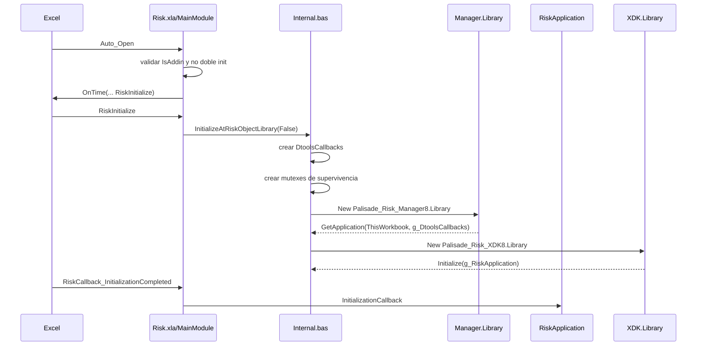
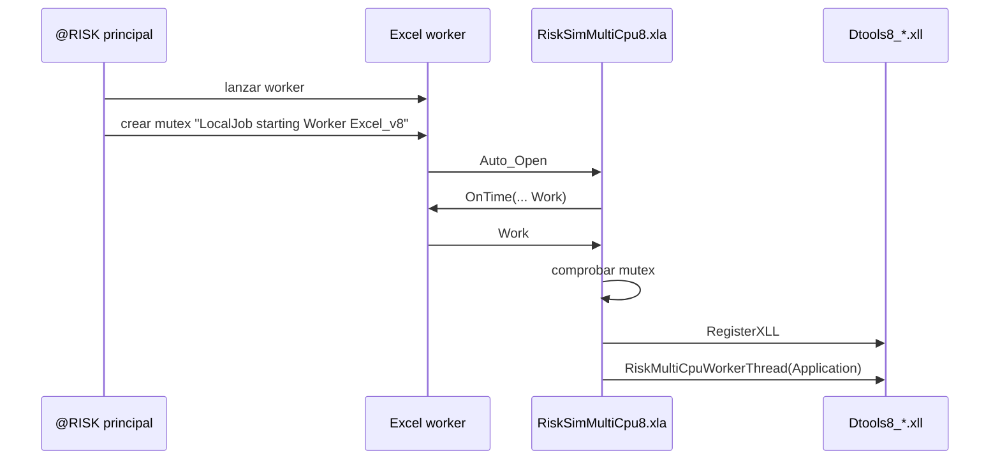
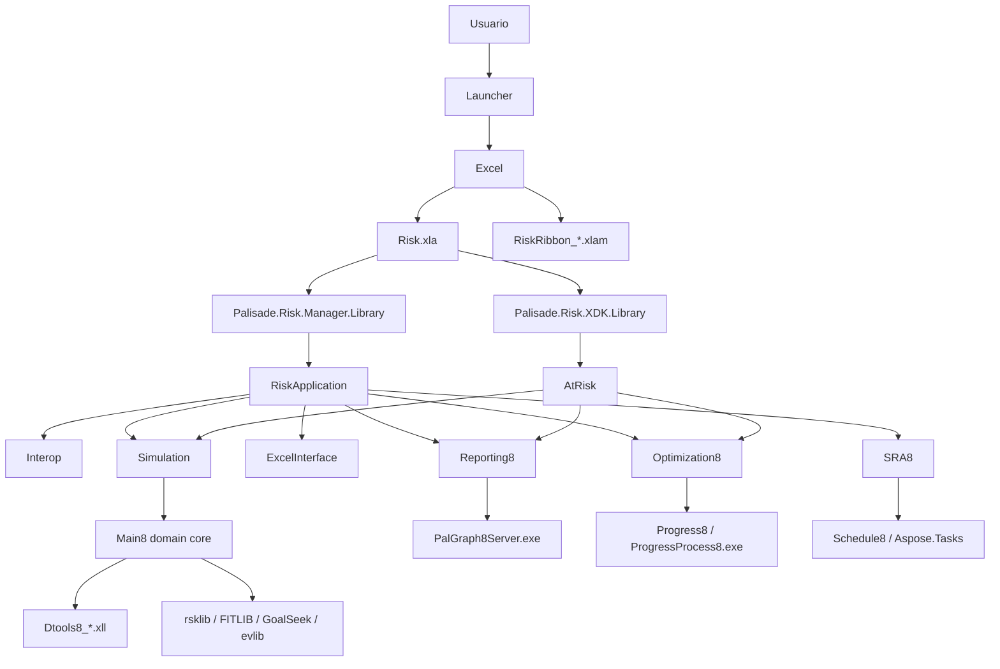

# @RISK 8 - COM, VBA, flujos internos, practicas y recomendaciones

## 1. Objetivo

Este documento complementa:

- [analisis_arquitectura_atrisk.md](D:/JimRisk/RiskCode/Apurisk/analisis_arquitectura_atrisk.md)
- [atrisk_scrape_completo.md](D:/JimRisk/RiskCode/Apurisk/atrisk_scrape_completo.md)

Aqui concentro tres cosas:

1. **capa COM registrada y contratos expuestos**
2. **flujo real observado en VBA extraido de `Risk.xla` y add-ins relacionados**
3. **practicas de arquitectura y recomendaciones concretas**

## 2. Hallazgos nuevos mas importantes

### 2.1 `Risk.xla` ya no crea directamente el ProgID legacy `RiskProgress8.Library`

En el VBA extraido de `Risk.xla`, la constante:

- `PROGID_PROGRESS = "RiskProgress8.Library"`

aparece comentada, al igual que la creacion:

- `Set g_RiskProgress = CreateObject(PROGID_PROGRESS)`

Eso es importante porque muestra una **transicion de arquitectura**:

- antes existia un flujo mas directamente anclado al ProgID `RiskProgress8.Library`
- en esta version la responsabilidad parece haberse movido “inside Palisade.Risk.Manager”, segun los propios comentarios del VBA

En cambio, en el registro si aparece:

- `Palisade.Risk.Progress.Library`

Esto sugiere que la capa de progreso fue **renombrada/modernizada** y que el `XLA` conservó comentarios historicos.

### 2.2 El bootstrap real confirmado es `Manager.Library -> RiskApplication`

Esto ya no es inferencia fuerte: es un hecho observado tanto por VBA como por COM metadata.

En `Risk.xla`:

- `Dim managerLibrary As New Palisade_Risk_Manager8.Library`
- `Set g_RiskApplication = managerLibrary.GetApplication(ThisWorkbook, g_DtoolsCallbacks)`

Y en COM:

- `Palisade.Risk.Manager.Library`
  - ProgID: `Palisade.Risk.Manager.Library`
  - CLSID: `{DE1B2D8D-7C3C-35CA-8B19-C31ED8B429C2}`
  - Assembly: `Palisade.Risk.Manager8, Version=8.0.0.0`
  - `CodeBase = file:///C:/Program Files (x86)/Palisade/System/Palisade.Risk.Manager8.DLL`

### 2.3 El `XDK` se inicializa acoplado al `RiskApplication`

En el VBA extraido:

- `Set g_XDKLibrary = New Palisade_Risk_XDK8.Library`
- `Set g_XDKRoot = g_XDKLibrary.Initialize(g_RiskApplication)`

Esto confirma un punto muy importante:

- el `XDK` no arranca completamente “solo”
- se inicializa **contra la instancia viva de `RiskApplication`**
- por eso el `XDK` depende del contexto de la aplicacion ya inicializado

### 2.4 El multiproceso usa workers Excel coordinados por mutex

`RiskSimMultiCpu8.xla` ya confirma esto con mucho mas detalle:

- `Application.RegisterXLL (...)`
- `RiskMultiCpuWorkerThread Application`
- chequeo del mutex: `LocalJob starting Worker Excel_v8`

Entonces el modo multi-CPU no es solo “threads internos en una DLL”.

La evidencia sugiere:

- se disparan **workers ligados a instancias o contextos Excel**
- esos workers cargan `Dtools8_x86/x64.XLL`
- el punto de entrada real del worker es `RiskMultiCpuWorkerThread`

## 3. Capa COM registrada

## 3.1 ProgIDs raiz encontrados

### Registrados y confirmados

- `Palisade.Risk.Manager.Library`
- `Palisade.Risk.XDK.Library`
- `Palisade.Risk.Progress.Library`
- `RiskOutOfProcessServer8.ObjectCreator`

### Referenciados por el VBA pero no presentes como ProgID actual directo

- `RiskProgress8.Library`
- `AtRiskOL8.RiskOL`

Interpretacion:

- `RiskProgress8.Library` parece ser nombre legacy/de transicion
- `AtRiskOL8.RiskOL` aparece en comentarios/cadenas historicas y referencias, pero no fue hallado como ProgID registrado directo en esta maquina

## 3.2 Tabla COM raiz

| Rol | ProgID | CLSID | Tipo | Ubicacion |
|---|---|---|---|---|
| Façade de aplicacion | `Palisade.Risk.Manager.Library` | `{DE1B2D8D-7C3C-35CA-8B19-C31ED8B429C2}` | .NET COM Inproc | `Palisade.Risk.Manager8.dll` |
| API XDK | `Palisade.Risk.XDK.Library` | `{176A9237-2A5F-3F70-B16B-B4FA70F046DC}` | .NET COM Inproc | `Palisade.Risk.XDK8.dll` |
| Biblioteca de progreso | `Palisade.Risk.Progress.Library` | `{9B1B8207-4EA0-31DB-979F-9D6C861A039F}` | .NET COM Inproc | `Palisade.Risk.Progress8.dll` |
| Factory OOP legacy | `RiskOutOfProcessServer8.ObjectCreator` | `{F0FFFE84-AD1D-440A-B533-6994C1C491C3}` | COM LocalServer32 | `RiskOutOfProcessServer.exe` |

## 3.3 Detalle de registro

### `Palisade.Risk.Manager.Library`

Registro observado:

- `InprocServer32 = mscoree.dll`
- `ThreadingModel = Both`
- `Assembly = Palisade.Risk.Manager8, Version=8.0.0.0`
- `RuntimeVersion = v4.0.30319`
- `CodeBase = file:///C:/Program Files (x86)/Palisade/System/Palisade.Risk.Manager8.DLL`

Esto confirma una clase **.NET COM visible cargada via CLR/COM interop**.

### `Palisade.Risk.XDK.Library`

Registro observado:

- `InprocServer32 = mscoree.dll`
- `Assembly = Palisade.Risk.XDK8, Version=8.0.0.0`
- `RuntimeVersion = v4.0.30319`
- `CodeBase = file:///C:/Program Files (x86)/Palisade/System/Palisade.Risk.XDK8.DLL`

### `RiskOutOfProcessServer8.ObjectCreator`

Registro observado:

- solo claramente materializado bajo vista `Wow6432Node`
- `LocalServer32 = C:\Program Files (x86)\Palisade\RISK8\RiskOutOfProcessServer.exe`
- `TypeLib = {337FE15F-BCD7-4087-9F6F-A9EEB1BACF40}`

Interpretacion:

- es una pieza COM **out-of-process de 32 bits**
- no es un assembly .NET administrado
- hace de factory/host OOP legacy

## 3.4 Type Libraries observadas

### `Manager8`

- GUID: `{F2B73C18-D1AA-45B5-AC24-4A128860C898}`
- nombre: `Palisade_Risk_Manager8`
- archivo: `C:\Program Files (x86)\Palisade\System\Palisade.Risk.Manager8.tlb`

### `XDK8`

- GUID: `{D3672192-D2C6-4AAE-B2E9-7EF76B6A67B5}`
- nombre: `Palisade_Risk_XDK8`
- archivo: `C:\Program Files (x86)\Palisade\System\Palisade.Risk.XDK8.tlb`

### `Progress8`

- GUID: `{3096ACC3-FA61-4DD5-A529-5BBD332D0FF4}`
- nombre: `Palisade_Risk_Progress8`
- archivo: `C:\Program Files (x86)\Palisade\System\Palisade.Risk.Progress8.tlb`

### `Main8`

- GUID: `{00F5E57C-6160-48A3-B2F3-EB77C12C1E34}`
- nombre: `Palisade_Risk_Main8`
- version registrada: `a.0` que corresponde a `10.0`
- archivo: `C:\Program Files (x86)\Palisade\System\Palisade.Risk.Main8.tlb`

### `RiskOutOfProcessServer`

- GUID: `{337FE15F-BCD7-4087-9F6F-A9EEB1BACF40}`
- nombre: `Palisade @RISK Out-of-Process Server 8.0`
- archivo: `C:\Program Files (x86)\Palisade\RISK8\RiskOutOfProcessServer.exe`

## 4. Contratos COM realmente expuestos

## 4.1 `Manager`

### Interface `_RiskApplication`

IID:

- `{C8F09828-191C-3664-856B-6E844F46814A}`

Metodos observados en COM:

- `InitializationCallback`
- `Shutdown`
- `_get_Interop`
- `_get_Simulation`
- `ExecuteRibbonCommand`
- `ExecuteContextMenuCommand`
- `ExecuteCommand`
- `GetRibbonDynamicMenu`
- `ExampleShapeClicked`
- `PrepareForAddinTermination`
- `ProcessWorkbooksOpenAtProductShutdown`

### Interface `_Interop`

Reflection sobre la clase concreta `Palisade.Risk.Manager.Interop` muestra:

- `UpdateInterface`
- `StartBrowsingResults`
- `StopBrowsingResults`
- `SetInterfaceMode`
- `TranslateFormulaLocalToUS`
- `TranslateFormulaUSToLocal`
- `RunningSimulationUpdate`
- `AdvToolsBetweenSimulationsCallback`
- `UnprotectSheet`
- `UnprotectWorkbook`
- `UnprotectAuxiliaryCells`
- `UpdateLinkedFits`
- `PerformOptimizationSimulation`
- `RISKOptimizerModelDefinitionChanged`
- `ReadOptimizationDefault`
- `WriteOptimizationDefault`
- `MakeGraphForOptimizationTargetOutput`
- `RiskOptGiveControl`
- `SRACalculate`
- `SpecialBeforeSaveEvent`
- `ColorCellsCallback`
- `DisplayReportPlacementDialog`

Esto es clave: `Interop` no es “ruido”. Es el **puente operativo Excel <-> motor**.

### Interface `_Simulation`

La clase concreta `Palisade.Risk.Manager.Simulation` expone:

- `Settings`
- `Results`
- `ResetSimulationSettingsToUserDefaults`
- `ClearResults`
- `Start`
- `PerformOptimizationSimulation`
- `StartAdvancedToolsSimulation`

## 4.2 `XDK`

### Interface `_Library`

IID:

- `{069451E6-B027-3DC6-9090-94D644C1D68B}`

Metodos:

- `Initialize(_RiskApplication) -> _AtRisk`
- `Free()`

Este es el punto de enganche formal entre XDK y aplicacion viva.

### Interface `_AtRisk`

IID:

- `{A2A6DA08-95E0-3808-980E-7BECF31BE35A}`

Propiedades expuestas via COM:

- `Constants`
- `Model`
- `Simulation`
- `Optimization`
- `Fits`
- `Preferences`
- `ProductInformation`
- `ExcelApplication`
- `Addin`
- `DisplayAlerts`
- `BaseIndex`
- `UseIEEEDoubles`
- `ApplyUserPreferencesToXDK`

### Interface `_RiskSimulation`

IID:

- `{CEF19CF0-C2E6-3206-A746-4D38B0AF7954}`

Metodos:

- `Start`
- `DisplayBrowseResultsWindow`
- `CloseBrowseResultsWindow`
- `DisplayResultsSummaryWindow`
- `NewGoalSeekAnalysis`
- `NewAdvSensitivityAnalysis`
- `NewStressAnalysis`

### Interface `_RiskSimulationSettings`

IID:

- `{46009CAC-449C-3915-8728-7E6C32953B0D}`

Cantidad observada de miembros COM:

- `100`

Incluye:

- `ResetToDefaults`
- `ShowDialog`
- `SaveToWorkbook`
- `LoadFromWorkbook`
- `NumIterations`
- `MaxAutoIterations`
- `NumSimulations`
- `MultipleCPUMode`
- `MultipleCPUCount`
- `StdRecalcBehavior`
- muchas mas propiedades de convergencia, RNG, macros y goal seek

### Interface `_RiskSimResults`

IID:

- `{4653A307-AAB8-3116-A8FE-2510190CDFD9}`

Metodos relevantes:

- `Clear`
- `GetSimulatedOutput`
- `GetSimulatedInput`
- `GraphDistribution`
- `GraphScatter`
- `GraphSummaryTrend`
- `GraphSummaryBoxPlot`
- `GraphSummaryLetterValue`

### Interface `_RiskGraph`

IID:

- `{2D7F695C-B328-3616-A7EF-AD12447B27B4}`

Cantidad observada de miembros COM:

- `70`

Metodos relevantes:

- `ImageToFile`
- `ImageToClipboard`
- `ImageToWorksheet`
- `ChartInExcelFormat`
- `DefineNumberFormatting`
- `HistogramChangeBinning`
- `HistogramGetBinning`
- `AxisChangeScale`

### Interface `_RiskFitDefinition`

IID:

- `{772FB6D5-0EC5-3EDA-A09F-18A2B0E61902}`

Cantidad observada de miembros COM:

- `79`

Incluye:

- `DataRange`
- `DataType`
- `FilterType`
- `BestFitSelectorStatistic`
- `FitMethod`
- `PerformFit`
- `PerformBatchFit`

### Interface `_RiskOptimization`

IID:

- `{5AFE902D-4C63-3B48-AC8D-8F1B01131E05}`

Metodos relevantes:

- `Optimize`
- `ModelWorkbook`
- `WorkbookHasModel`
- `ResetWorkbook`
- `SolveConstraints`

### Interface `_RiskReports`

IID:

- `{821E622E-1001-3D15-B741-1B4D36E8763C}`

Metodos relevantes:

- `CreateOutputReport`
- `CreateInputReport`
- `CreateSummaryStatisticsReport`
- `CreateDetailedStatisticsReport`
- `CreateSensitivityReport`
- `CreateScenarioReport`
- `CreateSimulationDataReport`
- `CreateTemplateSheetReport`
- `NewMultipleReport`

### Interface `_RiskGoalSeekAnalysis`

IID:

- `{A0AB2D4A-32DB-390F-821F-19D4503CDD21}`

### Interface `_RiskStressAnalysis`

IID:

- `{0E11BF2B-1FC1-3F97-BCD9-82ADA7F9B92F}`

## 5. Flujos reales extraidos del VBA

## 5.1 Flujo de arranque del add-in

### Hecho

`Auto_Open` en `MainModule.bas` no inicializa todo directamente. Hace:

- validacion de `ThisWorkbook.IsAddin`
- validacion de que `g_RiskApplication` aun no exista
- defer con `Application.OnTime Now(), ThisWorkbook.name & "!RiskInitialize"`

### Interpretacion

Esto es una practica muy consciente para evitar problemas del host Excel:

- no hacer inicializacion compleja dentro de `Auto_Open`
- devolver control a Excel primero
- luego arrancar la inicializacion real

### Flujo

## 5.2 Flujo de shutdown

### Hecho

`DisposeAtRiskLibrary` hace:

1. `g_XDKLibrary.Free`
2. `g_RiskApplication.Shutdown`
3. destruye mutex
4. limpia callbacks

### Interpretacion

El orden importa:

- primero baja automatizacion/XDK
- luego la aplicacion principal
- al final destruye el “lifeline” visible para componentes externos

Esto evita dejar procesos auxiliares vivos o referencias colgantes.

## 5.3 Flujo Ribbon -> aplicación

### Hecho

En `Ribbon.bas`:

- `RiskRibbonEvent_CommandClick`
  - hace `Application.Run m_MainAddinName & "!RiskEvent_ExecuteRibbonCommand", p_Control.ID`

En `MainModule.bas`:

- `RiskEvent_ExecuteRibbonCommand`
  - hace `g_RiskApplication.ExecuteRibbonCommand ...`

### Interpretacion

El ribbon no llama directo al motor:

1. callback Office
2. `Application.Run` al add-in principal
3. `RiskApplication.ExecuteRibbonCommand`

Es un diseño muy desacoplado del documento `XLAM`.

## 5.4 Flujo de refresh de estado de Ribbon

### Hecho

`RibbonController` guarda estado de controles en una coleccion:

- visible
- enabled
- toggled
- text

Y expone:

- `SetControlStateInformationArray`
- `ControlVisible`
- `ControlEnabled`
- `ControlToggled`
- `ControlText`

### Interpretacion

El patrón es:

- la lógica .NET calcula un array de estado
- el controller VBA solo actúa como caché/adapter para Office Ribbon callbacks

Eso reduce ida y vuelta costosa con Office en cada query.

## 5.5 Flujo de simulación viva

### Hecho

En `MainModule.bas`:

- `RiskEvent_UpdateSimulationWindows`
  - llama `g_RiskApplication.Interop.RunningSimulationUpdate`

### Interpretacion

Durante la simulación:

- `Dtools.xll` emite eventos o callbacks periódicos
- el add-in VBA los enruta a `Interop`
- la capa .NET actualiza ventanas/resultados en vivo

## 5.6 Flujo advanced tools entre simulaciones

### Hecho

- `RiskCallback_AdvToolsBetweenSimulations`
  - llama `g_RiskApplication.Interop.AdvToolsBetweenSimulationsCallback`

### Interpretacion

En análisis avanzados de múltiples corridas:

- tras cada simulación hay una fase de almacenamiento/reconfiguración
- esa coordinación vive en `Interop`

## 5.7 Flujo SRA

### Hecho

`MainModule.bas` define:

- `SetupSRACalculatorMacroName`
  - `RiskSetScheduleCalculatorMacroName "SRASimulateRecalc"`
- `SRASimulateRecalc`
  - `g_RiskApplication.Interop.SRACalculate(...)`

### Interpretacion

El motor SRA usa una llamada desde `Dtools8_x86/x64.XLL` hacia una macro VBA conocida por nombre:

1. se registra el nombre de macro
2. `Dtools` invoca `SRASimulateRecalc`
3. la macro delega a `.Interop.SRACalculate`

Ese es un patrón de integración Excel/XLL muy clásico y muy efectivo.

## 5.8 Flujo multiproceso

### Hecho

`RiskSimMultiCpu8.xla` hace:

- `Application.RegisterXLL (...)`
- chequea mutex `LocalJob starting Worker Excel_v8`
- llama `RiskMultiCpuWorkerThread Application`

### Interpretacion

La arquitectura multiproceso parece:

1. proceso/controlador principal crea señal de job via mutex
2. worker Excel abre `RiskSimMultiCpu8.xla`
3. worker registra `Dtools8_x86/x64.XLL`
4. worker entra a `RiskMultiCpuWorkerThread`

### Flujo

## 6. Practicas de arquitectura que @RISK si aplica bien

## 6.1 Bootstrap diferido para convivir con Excel

Práctica detectada:

- no hacer trabajo pesado en `Auto_Open`
- usar `Application.OnTime`

Por qué es buena:

- Excel es frágil en inicialización
- baja riesgo de deadlocks o errores del host

## 6.2 Façade central para comandos UI

Práctica detectada:

- toda UI desemboca en `RiskApplication`

Ventaja:

- la UI Ribbon/VBA no contiene lógica de negocio
- el sistema se gobierna por comandos uniformes

## 6.3 Interop segregado

Práctica detectada:

- `RiskApplication.Interop` concentra callbacks host-específicos

Ventaja:

- no contamina toda la capa de dominio con detalles de Excel
- centraliza traducción de fórmulas, callbacks, unprotect, SRA, etc.

## 6.4 Separación entre automatización pública y runtime interno

Práctica detectada:

- `Manager` para runtime/aplicación
- `XDK` para API pública de automatización

Ventaja:

- el contrato externo queda más estable
- el runtime puede evolucionar detrás del `XDK`

## 6.5 Persistencia de configuración en workbook

Práctica detectada:

- `SimulationSettings.SaveToWorkbook`
- `SimulationSettings.LoadFromWorkbook`
- `GoalSeekAnalysis.WriteSettingsToWorkbook`
- `StressAnalysis.WriteSettingsToWorkbook`

Ventaja:

- modelos autocontenidos
- reproducibilidad
- portabilidad entre usuarios/máquinas

## 6.6 Procesos auxiliares OOP para robustez

Práctica detectada:

- progreso OOP
- servidores gráficos OOP

Ventaja:

- aislar UI pesada
- bajar riesgo de colgar el host Excel

## 6.7 Compatibilidad fuerte con x86/x64

Práctica detectada:

- `#If Win64 Then`
- `DTOOLS8_x64.XLL` / `DTOOLS8_x86.XLL`
- DLLs nativas separadas por arquitectura

Ventaja:

- control explícito del runtime por bitness

## 6.8 Señales de vida y ownership por mutex

Práctica detectada:

- `PalisadeSurvivalMutex_RiskXLA`
- `AtRiskMutexAddinLoaded8`
- mutexes de jobs worker

Ventaja:

- coordinación simple entre procesos
- detección de muerte anómala del host

## 7. Debilidades o costos de esta arquitectura

## 7.1 Complejidad alta de integración

Convivir con:

- VBA
- COM
- .NET
- XLL
- DLL nativas
- procesos OOP

vuelve el sistema potente pero también costoso de mantener.

## 7.2 Dependencia fuerte de Excel/Office internals

La plataforma completa vive muy pegada a:

- eventos Excel
- Ribbon callbacks
- `Application.Run`
- `OnTime`
- protección de hojas/libros
- referencias COM de Office

Eso dificulta migración.

## 7.3 Acumulación histórica

Hay huellas claras de evolución:

- ProgIDs legacy comentados
- nombres históricos como `RiskOL`
- separación extraña entre callbacks `DtoolsCallbacks` e `Interop`

No es malo, pero sí evidencia deuda histórica.

## 8. Recomendaciones si quisieras reimplementar algo parecido

## 8.1 Mantener separación de capas

Si se reconstruye:

- `Host adapter` para Excel
- `Application façade`
- `Interop adapter`
- `Domain core`
- `Compute engine`
- `Automation API`

No mezclar UI, automatización y motor.

## 8.2 Mantener bootstrap mínimo en Excel

La decisión de @RISK aquí es buena y conviene replicarla:

- bootstrap corto
- inicialización diferida
- manejo claro de doble carga

## 8.3 Reemplazar mutexes por contrato más formal solo si el costo lo justifica

Los mutexes aquí son simples y efectivos.  
No los cambiaría por RPC más complejo salvo que hubiera necesidades fuertes de observabilidad o seguridad.

## 8.4 Mantener API pública separada del runtime

El patrón `XDK.Initialize(application)` es bueno.

Recomendación:

- mantener una API de automatización estable
- no exponer internals del runtime directamente

## 8.5 Si se moderniza, migrar COM solo en la frontera

No intentaría rehacer todo en COM.  
Lo razonable sería:

- COM solo en frontera Excel/Office
- resto del sistema en una capa moderna bien testeable

## 8.6 Preservar persistencia en workbook

Es una muy buena práctica para software de modelado en Excel:

- settings
- resultados
- configuraciones de análisis

deben poder vivir con el workbook.

## 8.7 Formalizar mejor eventos de simulación

Si se reimplementa:

- usar un bus/event stream interno
- adaptar luego a Excel callbacks

@RISK ya hace algo parecido, pero bastante amarrado a `Interop`.

## 8.8 Diseñar explicitamente para multiproceso

El patrón worker de @RISK es potente, pero si se rehace conviene documentar bien:

- quién crea el worker
- cómo se descubre el job
- quién posee el ciclo de vida
- cómo se reporta progreso
- qué pasa si el host muere

## 9. Recomendaciones si quisieras integrarte con @RISK

## 9.1 Preferir `Palisade.Risk.XDK.Library`

Si lo que quieres es automatizar:

- usar `Palisade.Risk.XDK.Library`
- obtener `AtRisk`
- trabajar por `Model`, `Simulation`, `Optimization`, `Reports`

Es mucho más estable que intentar disparar macros internas.

## 9.2 Evitar depender del VBA interno

El VBA sirve para comprender arquitectura, pero no debería ser tu API objetivo.

## 9.3 Tratar `Manager.Interop` como zona sensible

Sirve mucho para entender el runtime, pero está claramente más acoplado a implementación interna y Excel.

## 9.4 Tener cuidado con bitness

Si automatizas o integras:

- validar Excel x86/x64
- validar DLL/XLL correctas
- validar registro COM correcto

## 10. Modelo final que yo usaría para explicar @RISK 8

## 11. Conclusión

Con todo lo extraído, mi lectura final es esta:

- `Risk.xla` es el **arranque real**
- `Manager.Library` es la **puerta COM principal del runtime**
- `RiskApplication` es la **façade operativa**
- `Interop` es el **adaptador host-específico a Excel/XLL**
- `XDK.Library` es la **puerta de automatización pública**
- `Main8` es el **core de dominio**
- `Dtools` y DLLs nativas son el **motor de ejecución/rendimiento**
- workers, progreso y gráficos usan **aislamiento de proceso donde conviene**

Si tuviera que resumir el patrón general en una frase:

> @RISK 8 está diseñado como una aplicación de dominio compleja escondida detrás de un shell Excel, donde VBA arranca, COM conecta, .NET gobierna y binarios nativos calculan.

