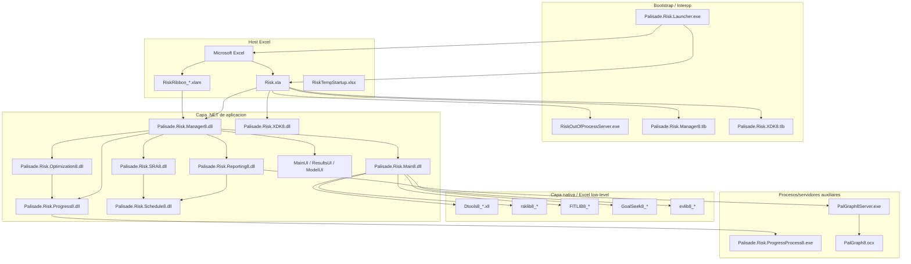
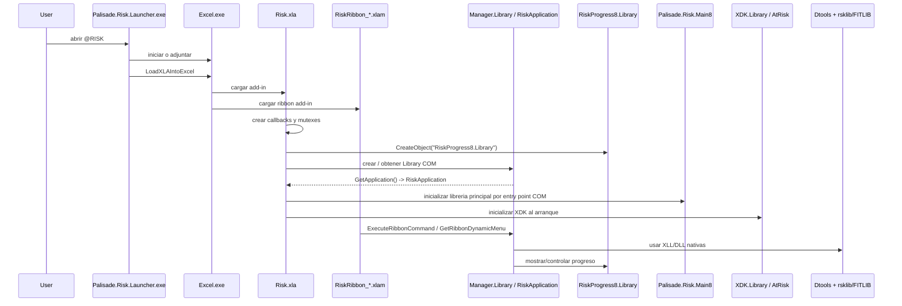
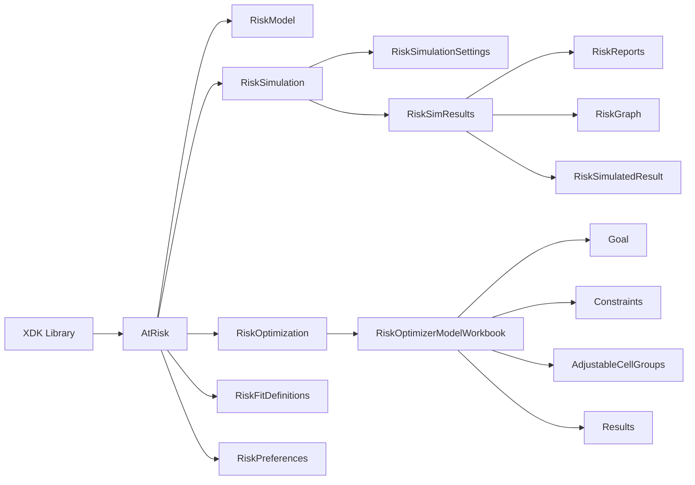
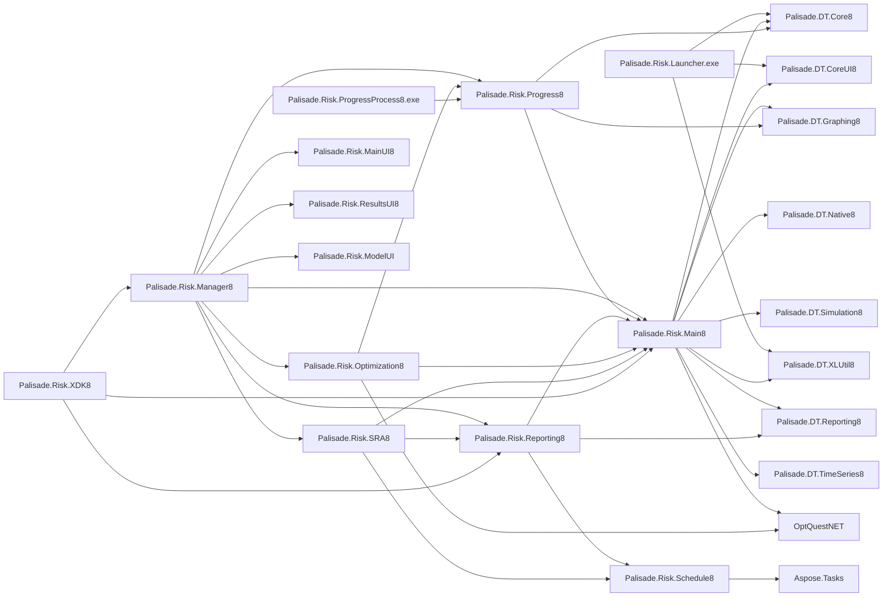

# @RISK 8 - scrapeado completo de arquitectura, arranque, XDK y dependencias

## 1. Proposito

Este documento intenta reconstruir **como funciona @RISK 8 de punta a punta** usando la instalacion local en:

- `C:\Program Files (x86)\Palisade\RISK8`
- `C:\Program Files (x86)\Palisade\System`

No es codigo fuente original. Es una reconstruccion por **scraping binario / metadatos / reflection / strings / type libraries**.

Por eso voy a separar siempre:

- **hecho observado**
- **inferencia tecnica**

## 2. Metodo usado

Se inspeccionaron:

- add-ins de Excel `XLA` y `XLAM`
- ejecutables auxiliares
- DLLs .NET y nativas
- type libraries `.tlb`
- ayuda `CHM` del `XDK`
- cadenas internas relevantes
- referencias entre assemblies

Tecnicas aplicadas:

- reflection de assemblies .NET
- enumeracion de tipos exportados
- lectura de referencias de assemblies
- carga de `type libraries` con `oleaut32`
- inspeccion de `customUI.xml` dentro de `XLAM`
- extraccion de cadenas ASCII/Unicode

## 3. Resumen ejecutivo

La arquitectura de `@RISK 8` es una **arquitectura hibrida Office-centric** con cuatro grandes bloques:

1. **Shell Excel**
   - `Risk.xla`
   - `RiskRibbon_*.xlam`
   - `RiskTempStartup.xlsx`

2. **Servicios COM/.NET**
   - `Palisade.Risk.Manager8.dll`
   - `Palisade.Risk.Main8.dll`
   - `Palisade.Risk.XDK8.dll`
   - `Palisade.Risk.Progress8.dll`
   - varios `.tlb`

3. **Motores nativos de calculo**
   - `rsklib8_x86.dll`, `rsklib8_x64.dll`
   - `FITLIB8_*`
   - `GoalSeek8_*`
   - `evlib8_*`
   - `Dtools8_*.xll`

4. **Procesos auxiliares fuera de Excel**
   - `RiskOutOfProcessServer.exe`
   - `Palisade.Risk.ProgressProcess8.exe`
   - `PalGraph8Server.exe`
   - `PalGraph8.ocx`

La forma mas compacta de describirlo es esta:

> `@RISK 8` usa Excel como host, VBA/XLA como bootstrap, COM como pegamento, .NET Framework como capa de aplicacion y DLLs nativas/XLLs para simulacion y rendimiento.

## 4. Huella principal de instalacion

### 4.1 Carpeta `RISK8`

Artefactos clave observados:

- `Risk.xla`
- `RiskRibbon_EN.xlam`
- `RiskRibbon_ES.xlam`
- `RiskRibbon_HI.xlam`
- `RiskOutOfProcessServer.exe`
- `RiskTempStartup.xlsx`
- `Examples\...`
- `XDK\RiskOL8.chm`

### 4.2 Carpeta `System`

Artefactos clave observados:

- `Palisade.Risk.Main8.dll`
- `Palisade.Risk.Manager8.dll`
- `Palisade.Risk.XDK8.dll`
- `Palisade.Risk.Progress8.dll`
- `Palisade.Risk.Reporting8.dll`
- `Palisade.Risk.Optimization8.dll`
- `Palisade.Risk.SRA8.dll`
- `Palisade.Risk.Schedule8.dll`
- `Palisade.Risk.Launcher.exe`
- `Palisade.Risk.ProgressProcess8.exe`
- `PalGraph8Server.exe`
- `PalGraph8.ocx`
- `Dtools8_x86.xll`, `Dtools8_x64.xll`
- `rsklib8_x86.dll`, `rsklib8_x64.dll`
- `Palisade.Risk.Main8.tlb`
- `Palisade.Risk.Manager8.tlb`
- `Palisade.Risk.Progress8.tlb`
- `Palisade.Risk.XDK8.tlb`

## 5. Arquitectura por capas

## 6. Flujo de arranque end-to-end

Esta es la parte mas importante para entender "como vive" @RISK.

### 6.1 Arranque externo: `Palisade.Risk.Launcher.exe`

**Hechos observados**

En las cadenas de `Palisade.Risk.Launcher.exe` aparecen:

- `StartExcelIfNotRunning`
- `LaunchExcel`
- `LaunchExcelAddIn`
- `LoadXLAIntoExcel`
- `GetExcelApplicationObject`
- `ExcelWindowExists`
- `CouldNotAttachToExcel`
- `RequiredExcelVersion`
- `Requires32BitExcel`
- `ShowProgressWindow`
- `KillProgressWindow`

**Inferencia**

El launcher no es el motor de simulacion. Es un **arrancador/adjuntador de Excel** que:

- abre Excel si hace falta
- se conecta a una instancia existente si puede
- inyecta/carga el add-in
- muestra progreso mientras el add-in sube
- valida compatibilidad de version/bitness

### 6.2 Carga del add-in Excel: `Risk.xla`

**Hechos observados**

`Risk.xla` contiene referencias internas a:

- `Palisade.Risk.Manager8.tlb`
- `Palisade.Risk.XDK8.tlb`
- `AtRiskOL8.RiskOL`
- `RiskOutOfProcessServer8.ObjectCreator`
- `RiskProgress8.Library`
- `PalisadeSurvivalMutex_RiskXLA`
- `AtRiskMutexAddinLoaded8`

Tambien contiene comentarios/cadenas muy claras:

- `This is the root .NET object for the @RISK Application in Palisade.Risk.Manager`
- `This is the out-of-process ActiveX Server for the progress window`
- `Create the Progress Window Server. This is ALWAYS out of process.`
- `Load and initialize the Risk.Main library via it's COM entry point`
- `Load the XDK library interface object and initialize it`
- `Create a Dtools callback object`
- `Set g_RiskProgress = CreateObject(PROGID_PROGRESS)`

**Inferencia**

`Risk.xla` es el **bootstrap principal** dentro de Excel. Sus responsabilidades probables son:

- crear el contexto base de la aplicacion
- crear callbacks hacia Excel y Dtools
- construir el objeto raiz .NET de @RISK via COM
- inicializar el servidor de progreso OOP
- inicializar el `XDK`
- mantener mutexes de supervivencia para que procesos externos sepan si Excel/add-in siguen vivos

### 6.3 Ribbon y comandos: `RiskRibbon_*.xlam`

**Hechos observados**

Los `XLAM` del ribbon contienen:

- `customUI/customUI.xml`
- `xl/vbaProject.bin`
- firmas VBA

Callbacks observados:

- `RiskRibbonEvent_CommandClick`
- `RiskRibbonEvent_GalleryItemSelected`
- `RiskRibbonEvent_RibbonLoad`
- `RiskRibbonQuery_GetControlText`
- `RiskRibbonQuery_GetDynamicMenuContent`
- `RiskRibbonQuery_GetEnabledState`
- `RiskRibbonQuery_GetItemCount`
- `RiskRibbonQuery_GetToggleState`
- `RiskRibbonQuery_GetVisibility`

**Inferencia**

El ribbon vive en una capa separada del `XLA` clasico:

- el `XLAM` define UI moderna para Office Ribbon
- el callback de UI baja a `RiskApplication`/Manager
- el `XLA` sigue conservando bootstrap, compatibilidad y glue logic

### 6.4 Objeto raiz de la aplicacion: `Palisade.Risk.Manager8`

**Hechos observados**

El `TLB` de Manager expone:

- `RiskApplication`
- `Interop`
- `Simulation`
- `Library`

Y por reflection:

- `Palisade.Risk.Manager.Library`
  - `GetApplication() -> RiskApplication`
- `Palisade.Risk.Manager.RiskApplication`
  - `InitializationCallback`
  - `Shutdown`
  - `ExecuteRibbonCommand`
  - `ExecuteContextMenuCommand`
  - `ExecuteCommand`
  - `GetRibbonDynamicMenu`
  - `PrepareForAddinTermination`
  - `WriteWorkbookInformation`
  - `ProcessWorkbooksOpenAtProductShutdown`

**Inferencia**

La secuencia probable es:

1. `Risk.xla` crea/obtiene un `Manager.Library`
2. desde ese `Library` obtiene `RiskApplication`
3. `RiskApplication` queda como **façade central** para:
   - comandos del ribbon
   - menus contextuales
   - shutdown ordenado
   - serializacion de estado a workbook

### 6.5 Progreso fuera de proceso

**Hechos observados**

`Risk.xla` usa el ProgID:

- `RiskProgress8.Library`

`Palisade.Risk.Progress8.tlb` expone:

- `Library`
- `ProgressWindowController`
- `ProgressWindowStartupConfiguration`
- `OptWatcherController`

`Palisade.Risk.Progress.Library` tiene metodos:

- `Initialize`
- `InitializeDoNet`
- `Shutdown`
- `CreateProgressWindowController`
- `CreateWatcherController`

`Palisade.Risk.ProgressProcess8.exe` referencia:

- `Palisade.Risk.Progress8`

Y sus cadenas incluyen:

- `CreateProgressWindowController`
- `InitializeApplication`
- `ShutdownApplication`

**Inferencia**

El progreso se maneja con un **servidor/proceso aparte**, probablemente para:

- no congelar Excel
- desacoplar UI reactiva del hilo principal de Excel
- supervisar optimizaciones o simulaciones largas

### 6.6 Graficos fuera de proceso

**Hechos observados**

`PalGraph8Server.exe` se presenta como:

- `Palisade Graphing Library 8.0 (ActiveX Server)`

Y sus cadenas incluyen:

- `Initialize`
- `InitializeExisting`
- `ChartInExcel`
- `PGrDistributionGraph`
- `PGrTornadoGraph`
- `PGrSummaryTrendGraph`
- `PrintGraph`

`PalGraph8.ocx` acompaña a ese servidor.

**Inferencia**

La capa de graficos no es solo charting .NET embebido. Existe una **libreria de graficos ActiveX especializada**, usada al menos por algunos flujos:

- distribuciones
- tornado/spider/scatter
- summary trend
- exportacion o pegado en Excel

### 6.7 Motor numerico y Excel low-level

**Hechos observados**

En `System` aparecen:

- `Dtools8_x86.xll`, `Dtools8_x64.xll`
- `rsklib8_x86.dll`, `rsklib8_x64.dll`
- `FITLIB8_x86.dll`, `FITLIB8_x64.dll`
- `GoalSeek8_x86.dll`, `GoalSeek8_x64.dll`
- `evlib8_x86.dll`, `evlib8_x64.dll`

En `Dtools8_x64.xll` aparecen nombres como:

- `DtoolsRegisterFunctions`
- `DtoolsReregisterFunctions`
- `DtoolsUnregisterFunctions`
- `DeleteRsklibDataFromWorkbook`
- `CleanupSim8`
- `CheckDistributionForErrorsNet`

**Inferencia**

La division de trabajo mas probable es:

- `Dtools8_*.xll`
  - integracion cercana a Excel
  - funciones worksheet/UDF
  - acceso eficiente a rangos y estados ocultos
- `rsklib8_*`
  - simulacion y calculo principal
- `FITLIB8_*`
  - fitting de distribuciones
- `GoalSeek8_*`
  - goal seek
- `evlib8_*`
  - utilidades o motores numericos complementarios

## 7. Cadena de arranque propuesta

## 8. Capa .NET: modulos y responsabilidades

### 8.1 `Palisade.Risk.Main8.dll`

**Hechos observados**

Exporta muchisimos tipos del namespace `Palisade.Risk.Main`, incluyendo:

- `SimulationSettings`
- `SimulationResults`
- `SimulatedResult`
- `RiskWorkbook`
- `GraphManager`, `Graphs`
- `FitDefinition`, `FitResult`, `FitCreator`
- `GoalSeekAnalysis`
- `StressAnalysis`
- `AdvSensitivityAnalysis`
- `OptModel`, `OptGoal`, `OptResults`, etc.

Sus referencias incluyen:

- `Palisade.DT.Core8`
- `Palisade.DT.Graphing8`
- `Palisade.DT.Native8`
- `Palisade.DT.ParseExcelFormula8`
- `Palisade.DT.Reporting8`
- `Palisade.DT.Simulation8`
- `Palisade.DT.TimeSeries8`
- `Palisade.DT.XLUtil8`
- `OptQuestNET`

**Inferencia**

Este es el **core de dominio** de @RISK:

- modelo de simulacion
- resultados
- fitting
- correlaciones
- stress/advanced sensitivity/goal seek
- parte de optimizacion
- graficos y definiciones de reporting

### 8.2 `Palisade.Risk.Manager8.dll`

**Hechos observados**

Exporta tipos como:

- `RiskApplication`
- `ExcelInterface`
- `Simulation`
- `DistributionFitting`
- `SimulationCommands`
- `ResultCommands`
- `ModelCommands`
- `ScheduleCommands`
- `ExamplesMenu`
- `DeveloperKitHelpMenu`

Referencias:

- `Palisade.Risk.Main8`
- `Palisade.Risk.Progress8`
- `Palisade.Risk.Reporting8`
- `Palisade.Risk.Optimization8`
- `Palisade.Risk.SRA8`
- `Palisade.Risk.MainUI8`
- `Palisade.Risk.ResultsUI8`
- `Palisade.Risk.ModelUI`

**Inferencia**

Es el **orquestador de producto**:

- traduce comandos de UI a operaciones
- conecta Excel, ribbon y dominio
- coordina subsistemas funcionales

### 8.3 `Palisade.Risk.Reporting8.dll`

**Hechos observados**

Exporta:

- `ReportServer`
- `DXOutputReport`
- `DXOptimizationReport`
- `DXSRAReport`
- `ReportsSetupDialog`
- `ReportSetupMultipleDialog`

Referencias:

- DevExpress `XtraReports`, `XtraPrinting`, `XtraGrid`, etc.
- `Palisade.Risk.Main8`
- `Palisade.Risk.Schedule8`

**Inferencia**

Maneja:

- generacion de reportes
- configuracion de layouts
- exportacion a Excel / impresion
- reportes especializados de optimizacion y SRA

### 8.4 `Palisade.Risk.Optimization8.dll`

**Hechos observados**

Exporta:

- `MulticoreManager`
- `OptimizationRunServer`
- `OptQuestServer`
- `OptQuestSettings`
- `EfficientFrontierUtils`

Referencias:

- `OptQuestNET`
- `Palisade.Risk.Main8`
- `Palisade.Risk.Progress8`

**Inferencia**

Es la capa de optimizacion/OptQuest:

- configuracion del solver
- coordinacion de corridas
- multicore para optimizacion
- progreso durante optimizacion

### 8.5 `Palisade.Risk.SRA8.dll`

**Hechos observados**

Exporta:

- `SRAMain`
- `SRASettings`
- `SRAGanttUserControl`
- `SRASettingsDialog`
- `SRAScheduleAuditDialog`

Referencias:

- `Palisade.Risk.Schedule8`
- `Palisade.Risk.Reporting8`
- DevExpress `XtraGantt`, `XtraTreeList`, `XtraGrid`

**Inferencia**

Esta es la capa de **Schedule Risk Analysis**:

- definicion de cronograma
- auditoria
- graficos gantt
- integracion con reporting

### 8.6 `Palisade.Risk.Schedule8.dll`

**Hecho observado**

Referencia:

- `Aspose.Tasks 23.1.0.0`

**Inferencia**

La lectura/manipulacion de cronogramas probablemente delega en `Aspose.Tasks`.

## 9. XDK: modelo de automatizacion

Esta es la segunda parte fuerte del pedido: entender el `XDK` como API.

### 9.1 Huella general

**Hechos observados**

`Palisade.Risk.XDK8.tlb` tiene `TypeInfoCount=199`.

Expone coclasses como:

- `Library`
- `AtRisk`
- `RiskModel`
- `RiskSimulation`
- `RiskSimulationSettings`
- `RiskSimResults`
- `RiskGraph`
- `RiskFitDefinition`
- `RiskFitResults`
- `RiskOptimization`
- `RiskOptimizerModelWorkbook`
- `RiskReports`
- `RiskGoalSeekAnalysis`
- `RiskStressAnalysis`
- `RiskAdvSensAnalysis`

Y muchisimos enums/records:

- `RiskMultipleCPUMode`
- `RiskRandomNumberGenerator`
- `RiskSamplingType`
- `RiskReportType`
- `RiskSimulationCompletionStatus`
- `RiskOptimizerStopReason`
- etc.

### 9.2 Objeto raiz del XDK

**Hechos observados**

`Palisade.Risk.XDK.Library`:

- `Initialize() -> AtRisk`
- `Free()`

`Palisade.Risk.XDK.AtRisk` propiedades:

- `Model`
- `Simulation`
- `Optimization`
- `Fits`
- `Preferences`
- `ProductInformation`
- `ExcelApplication`
- `Addin`

Metodos:

- `Help()`
- `WriteWorkbookInformation()`
- `UnloadAddin()`
- `Sample()`
- `SampleArray()`
- `RefreshUI()`

**Inferencia**

El `XDK` sigue un patron simple:

1. crear `XDK.Library`
2. llamar `Initialize()`
3. recibir un objeto `AtRisk`
4. navegar desde `AtRisk` a subsistemas:
   - `Model`
   - `Simulation`
   - `Optimization`
   - `Fits`
   - `Preferences`

### 9.3 Modelo mental del XDK

### 9.4 Superficie funcional del XDK

#### `RiskModel`

Metodos observados:

- `GetModelDefinition`
- `SwapOutFunctions`
- `SwapInFunctions`
- `DisplayDistributionArtistWindow`
- `DisplayDefineDistributionWindow`
- `DisplayInsertFunctionWindow`
- `DisplayFitDistributionWindow`
- `DisplayBatchFitWindow`
- `DisplayFitManagerWindow`
- `DisplayCorrelationMatrixDefinitionWindow`
- `DisplayCopulaDefinitionWindow`
- `DisplayFitCopulaWindow`
- `DisplayDataViewerWindow`
- `GraphDistribution`

**Lectura**

El `XDK` no solo automatiza calculo. Tambien expone parte de la **UI funcional del producto**.

#### `RiskSimulation`

Propiedades:

- `Settings`
- `Results`

Metodos:

- `Start`
- `DisplayBrowseResultsWindow`
- `CloseBrowseResultsWindow`
- `DisplayResultsSummaryWindow`
- `NewGoalSeekAnalysis`
- `NewAdvSensitivityAnalysis`
- `NewStressAnalysis`

**Lectura**

La simulacion es un subsistema de primer nivel, con settings, resultados y analisis secundarios.

#### `RiskSimulationSettings`

Propiedades observadas muy relevantes:

- `NumIterations`
- `NumSimulations`
- `MultipleCPUMode`
- `MultipleCPUCount`
- `StdRecalcBehavior`
- `AutomaticResultsDisplay`
- `ShowSimulationProgressWindow`
- `RandomNumberGenerator`
- `RandomSeed`
- `SamplingType`
- `CorrelationEnabledState`
- `MacroMode`
- `MacroBeforeSimulation`
- `MacroBeforeRecalculation`
- `MacroAfterRecalculation`
- `MacroAfterSimulation`
- `GoalSeekTargetCell`
- `GoalSeekTargetValue`
- `ConvergenceTestingEnabled`
- `ConvergenceTolerance`

Metodos:

- `ResetToDefaults`
- `ShowDialog`
- `SaveToWorkbook`
- `LoadFromWorkbook`

**Lectura**

Los settings de simulacion son claramente **persistibles en workbook**, y el `XDK` permite manipular:

- paralelismo
- convergencia
- macros
- semilla y RNG
- recalc

#### `RiskSimResults`

Propiedades:

- `Exist`
- `NumOutputs`
- `NumInputs`
- `NumSimulations`
- `RandomNumberSeed`
- `Filters`
- `Reports`

Metodos:

- `Clear`
- `GetSimulatedOutput`
- `GetSimulatedInput`
- `GraphDistribution`
- `GraphScatter`
- `GraphSummaryTrend`
- `GraphSummaryBoxPlot`
- `GraphSummaryLetterValue`
- `GraphSensitivityTornado`
- `GraphSensitivitySpider`
- `GraphScenarioTornado`

**Lectura**

Los resultados son un **objeto navegable** con acceso a graficos, filtros y reportes.

#### `RiskSimulatedResult`

Propiedades:

- `Minimum`
- `Maximum`
- `Mean`
- `Mode`
- `StdDeviation`
- `Skewness`
- `Kurtosis`
- `NumSamplesTotal`
- `NumSamplesUsed`
- `NumSamplesError`
- `NumSamplesFiltered`

Metodos:

- `GetSampleData`
- `CalculateRegressionSensitivities`
- `CalculateCorrelationSensitivities`
- `CalculateContributionToVariance`
- `CalculateStatisticChangeSensitivities`
- `CalculateScenarios`

**Lectura**

El `XDK` no solo devuelve resumenes; devuelve una capa de post-proceso estadistico bastante rica.

#### `RiskGraph`

Propiedades:

- `BackgroundColor`
- `ForegroundColor`
- `DistributionDisplayFormat`
- `DistributionSecondaryAxis`
- `LegendView`
- `SummaryCenterlineStatistic`
- `SummaryInnerRange`
- `SummaryOuterRange`
- `TitleMainText`

Metodos:

- `ImageToFile`
- `ImageToClipboard`
- `ImageToWorksheet`
- `ChartInExcelFormat`
- `HistogramChangeBinning`
- `AxisChangeScale`
- `AxisChangeScaleLog`
- `DelimitersChangePosition`

**Lectura**

La capa grafica del `XDK` esta bastante completa; no es un simple exportador de PNG.

#### `RiskFitDefinition`

Propiedades:

- `DataRange`
- `DataType`
- `FilterType`
- `BestFitSelectorStatistic`
- `FitMethod`
- `LowerLimitType`
- `UpperLimitType`
- `FixedParametersEnabled`
- `EstimatedFitsList`
- `PredefinedFitsList`
- `BootstrapEnabled`
- `ChiSqBinArrangement`
- `BatchFit`

Metodos:

- `PerformFit`
- `PerformBatchFit`

**Lectura**

El fitting se modela como objeto persistente/configurable, no como llamada suelta.

#### `RiskOptimization`

Propiedades:

- `OptimizationManager`
- `SuppressProgressWindowDuringAutomatedOptimizations`
- `GUI`

Metodos:

- `Optimize`
- `ModelWorkbook`
- `WorkbookHasModel`
- `ResetWorkbook`
- `SolveConstraints`

#### `RiskOptimizerModelWorkbook`

Propiedades:

- `Goal`
- `OptimizationSettings`
- `AdjustableCellGroups`
- `Constraints`
- `Results`
- `ExcelWorkbook`
- `AnalysisType`

**Lectura**

La optimizacion esta modelada sobre un **workbook con modelo**, no como un solver suelto desconectado de Excel.

#### `RiskReports`

Metodos:

- `CreateOutputReport`
- `CreateInputReport`
- `CreateSummaryStatisticsReport`
- `CreateDetailedStatisticsReport`
- `CreateSensitivityReport`
- `CreateScenarioReport`
- `CreateSimulationDataReport`
- `CreateTemplateSheetReport`
- `NewMultipleReport`

**Lectura**

El `XDK` permite generar casi toda la salida formal de @RISK desde automatizacion.

#### `RiskGoalSeekAnalysis` y `RiskStressAnalysis`

`RiskGoalSeekAnalysis` permite:

- definir celda objetivo
- estadistico objetivo
- rango de variacion
- tolerancia
- numero maximo de simulaciones
- `RunAnalysis`

`RiskStressAnalysis` permite:

- elegir output
- incluir reportes/graficos
- definir inputs
- `RunAnalysis`

### 9.5 Conclusion del XDK

Mi lectura es que el `XDK` fue pensado como una **API COM formal de automatizacion casi completa** para:

- operar @RISK desde VBA o .NET
- controlar settings
- ejecutar simulaciones
- leer resultados
- producir graficos
- hacer fitting
- correr goal seek / stress / advanced sensitivity
- manejar optimizacion
- generar reportes

No es un API "lite". Es una superficie extensa y bien modelada.

## 10. Dependencias reales entre componentes

Esta seccion resume referencias observadas entre assemblies, no solo inferencias.

### 10.1 Dependencias principales observadas

- `Palisade.Risk.Manager8.dll`
  - depende de `Main8`, `Progress8`, `Reporting8`, `Optimization8`, `SRA8`, `MainUI8`, `ResultsUI8`, `ModelUI`
- `Palisade.Risk.Main8.dll`
  - depende de `DT.Core8`, `DT.Graphing8`, `DT.Native8`, `DT.Simulation8`, `DT.XLUtil8`, `OptQuestNET`
- `Palisade.Risk.Progress8.dll`
  - depende de `Main8`, `DT.Core8`, `DT.Graphing8`
- `Palisade.Risk.Reporting8.dll`
  - depende de `Main8`, `Schedule8`, `DT.Reporting8`, DevExpress Reporting stack
- `Palisade.Risk.Optimization8.dll`
  - depende de `Main8`, `Progress8`, `OptQuestNET`
- `Palisade.Risk.SRA8.dll`
  - depende de `Main8`, `Reporting8`, `Schedule8`
- `Palisade.Risk.XDK8.dll`
  - depende de `Main8`, `Manager8`, `Reporting8`
- `Palisade.Risk.ProgressProcess8.exe`
  - depende de `Progress8`
- `Palisade.Risk.Launcher.exe`
  - depende de `DT.Core8`, `DT.CoreUI8`, `DT.XLUtil8`

### 10.2 Diagrama de dependencias entre assemblies

## 11. Mezcla tecnologica real

La instalacion muestra una tecnologia mixta muy marcada:

- `VBA/XLA/XLAM`
- `COM / ActiveX / TLB`
- `.NET Framework 4`
- `WinForms + DevExpress`
- `VB6 runtime` en algunos servidores legacy
- `XLL nativos`
- `DLLs nativas x86/x64`

### 11.1 Donde se nota lo legacy

- `Risk.xla`
- `RiskOutOfProcessServer.exe` importa `MSVBVM60.DLL`
- `PalGraph8Server.exe` importa `MSVBVM60.DLL`
- ProgIDs y `TypeLibs` orientados a COM

### 11.2 Donde se nota lo moderno

- assemblies `MSIL`
- `supportedRuntime v4.0`
- uso fuerte de DevExpress 21.2
- `Aspose.Tasks`
- `OptQuestNET`

### 11.3 Interpretacion

No parece una reescritura total. Parece una **evolucion por estratos**:

- se conserva el shell Excel/VBA
- se centraliza logica en .NET
- se sostienen motores nativos por rendimiento
- se mantienen piezas OOP/ActiveX donde el historial del producto lo exigia

## 12. Mi reconstruccion de "como funciona todo"

Si un usuario abre @RISK, el flujo mas probable es este:

1. `Palisade.Risk.Launcher.exe` arranca o adjunta a Excel.
2. El launcher fuerza la carga del add-in `Risk.xla`.
3. Excel carga tambien el ribbon `RiskRibbon_*.xlam`.
4. `Risk.xla` crea mutexes de supervivencia y callbacks COM para Excel/Dtools.
5. `Risk.xla` crea el servidor de progreso con `RiskProgress8.Library`.
6. `Risk.xla` crea/obtiene el root COM de `Palisade.Risk.Manager8`.
7. Desde `Manager.Library` obtiene `RiskApplication`.
8. `RiskApplication` queda a cargo de ejecutar comandos y coordinar el producto.
9. `Risk.xla` inicializa tambien el `XDK`, para evitar que cargas externas usen versiones equivocadas.
10. `RiskApplication` enruta comandos hacia:
    - `Main8` para dominio y simulacion
    - `Reporting8` para reportes
    - `Optimization8` para OptQuest/solver
    - `SRA8` para schedule risk
11. `Main8` usa `Dtools8_*.xll` y DLLs nativas (`rsklib8_*`, `FITLIB8_*`, etc.) para calculo y operacion cercana a Excel.
12. Los resultados vuelven a:
    - ventanas de progreso
    - graficos OOP
    - hojas/reportes de Excel
    - API `XDK`

## 13. Puntos especialmente importantes

### 13.1 @RISK no es "solo un add-in de Excel"

Aunque el frente visible sea Excel, internamente hay:

- multiples capas .NET
- motores nativos
- procesos auxiliares
- API COM completa

### 13.2 El `XDK` es de primera clase

No parece algo accesorio. El propio `Risk.xla` deja ver que lo inicializan temprano para controlar versionado y automatizacion.

### 13.3 El progreso y parte del rendering estan desacoplados del proceso Excel

Eso es una pista fuerte de que Palisade conocia bien las limitaciones del host Excel y quiso aislar:

- ventanas largas
- progreso
- algunos graficos

### 13.4 Hay una separacion clara entre orquestacion y motor

- `Manager` orquesta
- `Main` modela y gobierna dominio
- XLL/DLLs nativas ejecutan la parte intensiva o cercana a Excel

## 14. Limites y dudas abiertas

### 14.1 Confirmado con alta confianza

- Excel es el host principal
- `Risk.xla` hace bootstrap
- `RiskRibbon_*.xlam` implementa ribbon UI
- `Manager8` expone el root `RiskApplication`
- `Progress8` corre via proceso/servidor OOP
- `XDK8` es una API COM rica y extensa
- hay motor nativo y XLLs separados

### 14.2 Inferencias fuertes pero no 100% demostradas sin codigo fuente

- la secuencia exacta de llamadas entre `Risk.xla` y `Manager.Library`
- que `RiskOutOfProcessServer.exe` sea especificamente un factory/host general de OOP COM, aunque el nombre y strings lo sugieren mucho
- la implementacion precisa del multiproceso en simulacion frente a optimizacion

## 15. Conclusiones finales

Mi conclusion tecnica es esta:

1. `@RISK 8` es un **producto Excel-first**.
2. Usa `Risk.xla` como **bootstrapper heredado** y `RiskRibbon_*.xlam` como **capa de ribbon moderna**.
3. Usa `COM` como **contrato de interoperabilidad** entre VBA, .NET y componentes OOP.
4. Usa `Palisade.Risk.Manager8` como **façade/orquestador principal**.
5. Usa `Palisade.Risk.Main8` como **core de dominio**.
6. Usa `XLLs y DLLs nativas` como **capa de rendimiento y motor numerico**.
7. Usa `XDK` como **API formal de automatizacion**.
8. Usa procesos/servidores OOP para **progreso, graficos y robustez del runtime**.

En una frase:

> @RISK 8 es una plataforma de simulacion para Excel construida sobre una arquitectura historicamente acumulada pero bastante ordenada: shell Excel/VBA, contratos COM, aplicacion .NET modular y motores nativos de calculo.

## 16. Archivos mas importantes inspeccionados

- `C:\Program Files (x86)\Palisade\RISK8\Risk.xla`
- `C:\Program Files (x86)\Palisade\RISK8\RiskRibbon_EN.xlam`
- `C:\Program Files (x86)\Palisade\RISK8\RiskRibbon_ES.xlam`
- `C:\Program Files (x86)\Palisade\RISK8\RiskOutOfProcessServer.exe`
- `C:\Program Files (x86)\Palisade\RISK8\XDK\RiskOL8.chm`
- `C:\Program Files (x86)\Palisade\System\Palisade.Risk.Launcher.exe`
- `C:\Program Files (x86)\Palisade\System\Palisade.Risk.Main8.dll`
- `C:\Program Files (x86)\Palisade\System\Palisade.Risk.Manager8.dll`
- `C:\Program Files (x86)\Palisade\System\Palisade.Risk.Progress8.dll`
- `C:\Program Files (x86)\Palisade\System\Palisade.Risk.ProgressProcess8.exe`
- `C:\Program Files (x86)\Palisade\System\Palisade.Risk.Reporting8.dll`
- `C:\Program Files (x86)\Palisade\System\Palisade.Risk.Optimization8.dll`
- `C:\Program Files (x86)\Palisade\System\Palisade.Risk.SRA8.dll`
- `C:\Program Files (x86)\Palisade\System\Palisade.Risk.Schedule8.dll`
- `C:\Program Files (x86)\Palisade\System\Palisade.Risk.XDK8.dll`
- `C:\Program Files (x86)\Palisade\System\Palisade.Risk.Main8.tlb`
- `C:\Program Files (x86)\Palisade\System\Palisade.Risk.Manager8.tlb`
- `C:\Program Files (x86)\Palisade\System\Palisade.Risk.Progress8.tlb`
- `C:\Program Files (x86)\Palisade\System\Palisade.Risk.XDK8.tlb`
- `C:\Program Files (x86)\Palisade\System\PalGraph8Server.exe`
- `C:\Program Files (x86)\Palisade\System\PalGraph8.ocx`
- `C:\Program Files (x86)\Palisade\System\Dtools8_x86.xll`
- `C:\Program Files (x86)\Palisade\System\Dtools8_x64.xll`
- `C:\Program Files (x86)\Palisade\System\rsklib8_x86.dll`
- `C:\Program Files (x86)\Palisade\System\rsklib8_x64.dll`

