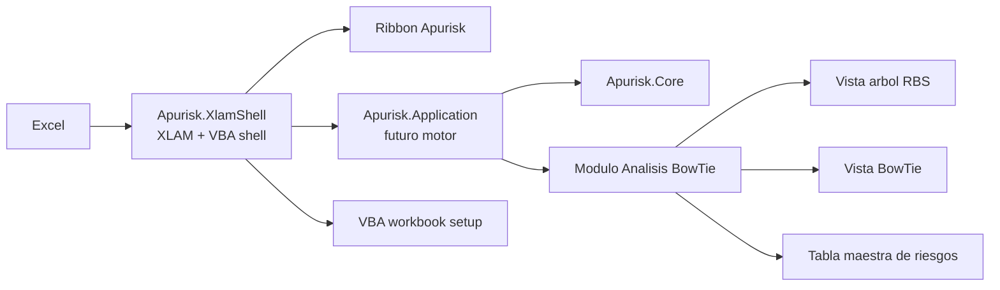
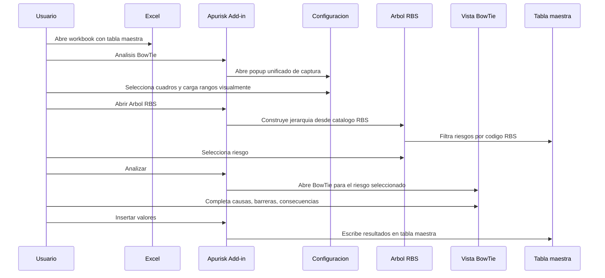

# Apurisk - arquitectura inicial del producto

## Objetivo

Apurisk sera un complemento de Excel orientado a estadistica y gestion de riesgos. El primer modulo sera **Analisis BowTie**, pero la base debe permitir agregar otros modulos despues, de forma parecida al patron observado en @RISK:

- Excel como superficie de usuario.
- Ribbon como entrada principal.
- Un add-in central que orquesta.
- Dominio y logica fuera de macros.
- Modulos independientes para analisis, reportes, diagramas y calculos.

## Arquitectura base



## Estructura creada

```text
Apurisk/
  Apurisk.sln
  docs/
    apurisk_arquitectura_inicial.md
    apurisk_architecture_log.md
  scripts/
    build.ps1
    register-addin.ps1
    unregister-addin.ps1
  src/
    Apurisk.Core/
    Apurisk.Application/
    Apurisk.ExcelAddIn/
    Apurisk.XlamShell/
```

## Responsabilidades

`Apurisk.XlamShell`

Shell inicial de Excel. Contiene Ribbon XML, callbacks VBA y preparacion del workbook. Su objetivo es darnos velocidad de desarrollo sin casarnos con macros como motor final.

`Apurisk.Application`

Casos de uso del producto. Aqui debe vivir el flujo estable del sistema a medida que saquemos logica fuera de la shell Excel.

`Apurisk.Core`

Modelo puro del dominio. Aqui viven objetos como `RiskItem`, `RbsNode`, `RiskMasterMapping`, `BowTieAnalysis`, `Hazard`, `Threat`, `Barrier` y `Consequence`.

## Ribbon inicial

La pestana se llama `Apurisk` y contiene el grupo `Analisis BowTie`.

Botones iniciales:

- `Analisis BowTie`: abre el popup unificado de captura para RBS y tabla maestra.
- `Arbol RBS`: placeholder para la vista tipo arbol de decision.
- `Abrir BowTie`: placeholder para abrir la vista BowTie del riesgo seleccionado.
- `Validar`: placeholder para validar columnas, RBS y riesgos incompletos.
- `Insertar valores`: placeholder para escribir resultados en la tabla maestra.

## Flujo previsto del modulo BowTie



## Hojas iniciales

`Apurisk_Config`

Parametros globales del modulo.

`Apurisk_RBS`

Catalogo jerarquico de RBS. Columnas iniciales: `CodigoRBS`, `Nombre`, `PadreRBS`, `Nivel`, `Descripcion`.

`Apurisk_RiskMaster_Map`

Mapeo entre campos de Apurisk y rangos reales de la tabla maestra.

`Apurisk_BowTie_Work`

Zona de trabajo temporal para guardar elementos del BowTie antes de escribirlos a la tabla maestra.

`Apurisk_Diagram`

Hoja reservada para renderizar el diagrama BowTie.

## Practica recomendada

El Ribbon debe ser delgado: solo recibe clics y delega. La logica de negocio debe ir saliendo de VBA hacia `Apurisk.Application` y `Apurisk.Core`, para que luego podamos cambiar la shell sin reescribir el motor.

La captura ya no vive en una hoja dedicada. Vive en un popup `UserForm` importable, y la persistencia se resuelve guardando direcciones de rango en `Apurisk_Config`.

La tabla maestra no debe ser asumida por posicion fija. El usuario debe configurar que columna representa `ID`, `RBS`, `Nombre`, `Descripcion` y cualquier campo BowTie que agreguemos despues.

En esta iteracion, el nombre recomendado del campo principal es `Codigo RBS del riesgo` y `Nombre RBS del riesgo` queda como opcional para evitar ambiguedad.

El catalogo RBS debe tratarse como jerarquia por codigo. Por ejemplo, `1`, `1.2`, `1.2.1`. Eso permite construir el arbol sin depender de celdas combinadas ni formatos visuales fragiles.

## Siguiente iteracion recomendada

La siguiente pieza debe ser una ventana real de configuracion, probablemente WinForms al inicio, con:

- selector de tabla maestra o rango actual;
- selector de columna `ID`;
- selector de columna `RBS`;
- selector de columna `Nombre/Riesgo`;
- selector de columna `Descripcion`;
- selector de tabla/rango del catalogo RBS;
- boton para guardar configuracion en `Apurisk_Config`;
- validacion de duplicados, RBS inexistentes y riesgos sin clasificar.

## Registro

Ultimo cambio: `2026-05-14 12:32 -05:00`

Ahora se trabaja en la shell `XLAM + VBA` de `Apurisk`, manteniendo la arquitectura por capas como direccion futura del producto. El foco inmediato es consolidar el popup unificado de captura, luego el arbol RBS y despues la vista BowTie del riesgo elegido.
